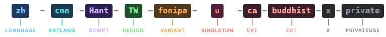

<h1 align="center">RFC BCP47</h1>

<p align="center">
  
</p>

<p align="center">
  Zero-dependency <a href="https://www.rfc-editor.org/info/bcp47">BCP 47</a> / <a href="https://datatracker.ietf.org/doc/html/rfc5646">RFC 5646</a> language tag toolkit for JavaScript and TypeScript
</p>

<p align="center">
  <a href="https://www.npmjs.com/package/rfc-bcp47"></a>
  <a href="https://www.npmjs.com/package/rfc-bcp47"></a>
  <a href="./LICENSE"></a>
</p>

---

> **Built with AI, end to end.** Every line in this repo &mdash; source, tests, docs, release scripts &mdash; is generated, reviewed, and verified through [Claude Code](https://docs.anthropic.com/en/docs/claude-code).
>
> - **Strict conventions enforced by the agent.** `.claude/rules/` pin TypeScript strict mode, `Array<T>`, `readonly` by default, no `any`, semantic naming (no `data` / `result` / `item`), and 18 testing rules &mdash; applied on every change without manual review.
> - **Bundled Claude Code skills** (`commit`, `verify`, `review`, `release`, `testing`) that drive the full lifecycle: lint &rarr; build &rarr; test &rarr; conventional commit &rarr; tag-triggered release with SLSA provenance via OIDC trusted publishing &mdash; powered by [`npm-trust`](https://github.com/gagle/npm-trust) (the `/solo-npm:release` skill itself comes from the [`solo-npm`](https://github.com/gagle/solo-npm) marketplace plugin).
> - **Co-located Vitest specs for every operator** (`parse`, `canonicalize`, `filter`, `lookup`, `extensionU` / `extensionT`, `acceptLanguage`). The agent writes the failing test first, then makes it pass &mdash; `pnpm test` is the regression net, not a checkbox.
> - **PRs disabled by design.** Contributors can't push code directly; the maintainer takes [issues](https://github.com/gagle/rfc-bcp47/issues) and [discussions](https://github.com/gagle/rfc-bcp47/discussions) through Claude Code. See [`CONTRIBUTING.md`](./CONTRIBUTING.md) for the full process.

---

- **Parse** any BCP 47 language tag into a structured, typed object
- **Stringify** a tag object back into a well-formed language tag string
- **Canonicalize** with case normalization and [IANA registry](https://www.iana.org/assignments/language-subtag-registry/language-subtag-registry) data (deprecated subtags, suppress-script, extlang)
- **Match** language tags with `filter` and `lookup` per [RFC 4647](https://datatracker.ietf.org/doc/html/rfc4647)
- **Extension U/T** extraction for Unicode locales ([RFC 6067](https://datatracker.ietf.org/doc/html/rfc6067)) and transformed content ([RFC 6497](https://datatracker.ietf.org/doc/html/rfc6497))
- **Accept-Language** header parsing per [RFC 9110](https://datatracker.ietf.org/doc/html/rfc9110#section-12.5.4)
- **WCAG-ready** &mdash; use `parse()` to validate `lang` attributes per [WCAG 2.x SC 3.1.1](https://www.w3.org/WAI/WCAG22/Understanding/language-of-page) and [SC 3.1.2](https://www.w3.org/WAI/WCAG22/Understanding/language-of-parts)
- **TypeScript-first** with full type inference and strict types out of the box
- **Zero dependencies**, tree-shakeable, works in Node.js and browsers

## Install

```bash
npm install rfc-bcp47
```

## Operators

Tree-shakeable operators &mdash; import only what you need.

### parse / stringify

```ts
import { parse, stringify } from 'rfc-bcp47';

const tag = parse('en-Latn-US');

if (tag?.type === 'langtag') {
  tag.langtag.language  // 'en'
  tag.langtag.script    // 'Latn'
  tag.langtag.region    // 'US'
}

stringify(tag!);  // 'en-Latn-US'

parse('invalid!');  // null
```

`parse` returns one of three tag types or `null` for invalid input:

| `type` | When | Fields available |
|--------|------|-----------------|
| `'langtag'` | Standard language tags (`en-US`, `zh-Hant-TW`) | `langtag.language`, `langtag.script`, `langtag.region`, `langtag.extlang`, `langtag.variant`, `langtag.extension`, `langtag.privateuse` |
| `'privateuse'` | Private use tags (`x-custom`) | `privateuse` |
| `'grandfathered'` | Legacy registered tags (`i-klingon`) | `grandfathered.type`, `grandfathered.tag` |

### langtag

Build a tag from known parts without parsing a string. Validates subtags and throws `RangeError` on invalid input:

```ts
import { langtag, stringify } from 'rfc-bcp47';

const tag = langtag('en', { region: 'US' });
stringify(tag);  // 'en-US'

langtag('!!!');  // RangeError — invalid language
```

### canonicalize

Reduce equivalent tags to a single canonical form — handles case normalization, deprecated subtags, suppress-script, extlang promotion, and extension ordering using [IANA registry](https://www.iana.org/assignments/language-subtag-registry/language-subtag-registry) data:

```ts
import { canonicalize } from 'rfc-bcp47';

canonicalize('iw');          // 'he'       (deprecated language)
canonicalize('zh-cmn');      // 'cmn'      (extlang to preferred)
canonicalize('en-Latn');     // 'en'       (suppress-script)
canonicalize('de-DD');       // 'de-DE'    (deprecated region)
```

### filter

Find all matching tags with subtag-aware filtering per [RFC 4647 &sect;3.3.2](https://datatracker.ietf.org/doc/html/rfc4647#section-3.3.2):

```ts
import { filter } from 'rfc-bcp47';

const tags = ['de', 'de-DE', 'de-Latn-DE', 'de-AT', 'en-US', 'fr-FR'];

filter(tags, 'de-DE');   // ['de-DE', 'de-Latn-DE']  (skips Latn to match DE)
filter(tags, 'de');      // ['de', 'de-DE', 'de-Latn-DE', 'de-AT']  (all German)
filter(tags, '*-DE');    // ['de-DE', 'de-Latn-DE']  (* wildcard = any language)
```

### lookup

Find the single best match via progressive truncation per [RFC 4647 &sect;3.4](https://datatracker.ietf.org/doc/html/rfc4647#section-3.4):

```ts
import { lookup } from 'rfc-bcp47';

const tags = ['en', 'en-US', 'fr', 'de'];

lookup(tags, 'en-US-x-custom');  // 'en-US' (truncates to match)
lookup(tags, 'fr-CA');           // 'fr'    (truncates to match)
lookup(tags, 'ja', 'en');        // 'en'    (default fallback)
```

Pair with `acceptLanguage` for HTTP content negotiation:

```ts
import { acceptLanguage, lookup } from 'rfc-bcp47';

const prefs = acceptLanguage('fr-CA, en-US;q=0.8, en;q=0.5');
const best = lookup(['en', 'en-US', 'fr', 'fr-CA'], prefs.map((p) => p.tag));
// 'fr-CA'
```

### extensionU / extensionT

Extract Unicode locale and transformed content extensions:

```ts
import { parse, extensionU, extensionT } from 'rfc-bcp47';

extensionU(parse('de-DE-u-co-phonebk-ca-buddhist')!);
// { attributes: [], keywords: { co: 'phonebk', ca: 'buddhist' } }

extensionT(parse('und-t-it-m0-ungegn')!);
// { source: 'it', fields: { m0: 'ungegn' } }
```

### acceptLanguage

Parse HTTP `Accept-Language` headers:

```ts
import { acceptLanguage } from 'rfc-bcp47';

acceptLanguage('fr-CA, en-US;q=0.8, en;q=0.5, *;q=0.1');
// [
//   { tag: 'fr-CA', quality: 1.0 },
//   { tag: 'en-US', quality: 0.8 },
//   { tag: 'en',    quality: 0.5 },
//   { tag: '*',     quality: 0.1 }
// ]
```

Try the [**interactive demo**](https://gagle.github.io/rfc-bcp47/) or see the [`examples/`](./examples) folder for more usage patterns.

## Operator Reference

| Operator | Description |
|----------|-------------|
| `parse(tag)` | Parse a BCP 47 tag string into a structured object. Returns `null` for invalid input. |
| `stringify(tag)` | Convert a parsed tag object back into a well-formed string. |
| `langtag(language, options?)` | Create a langtag object with sensible defaults. Throws `RangeError` on invalid input. |
| `canonicalize(tag)` | Normalize casing, sort extensions, apply [IANA registry](https://www.iana.org/assignments/language-subtag-registry/language-subtag-registry) mappings (deprecated subtags, suppress-script, extlang). Returns `null` for invalid input. |
| `filter(tags, patterns)` | Subtag-aware filtering with `*` wildcard support per RFC 4647 &sect;3.3.2. Returns matched tags. |
| `lookup(tags, preferences, defaultValue?)` | Lookup per RFC 4647 &sect;3.4. Returns first match or `defaultValue`/`null`. |
| `extensionU(tag)` | Extract Unicode locale attributes and keywords from the `u` extension. Takes a `BCP47Tag` (not a string). Returns `null` if absent. |
| `extensionT(tag)` | Extract transformed content data from the `t` extension. Takes a `BCP47Tag` (not a string). Returns `null` if absent. |
| `acceptLanguage(header)` | Parse an `Accept-Language` header into sorted `{ tag, quality }` entries. |

## CLDR Key References

Typed constants mapping extension keys to human-readable descriptions, sourced from the [CLDR BCP 47 data](https://github.com/unicode-org/cldr/tree/main/common/bcp47). Zero runtime cost &mdash; tree-shaken if unused.

| Constant | Description |
|----------|-------------|
| `UNICODE_LOCALE_KEYS` | U extension keys → descriptions (e.g. `ca` → `'Calendar'`, `nu` → `'Numbering system'`) |
| `TRANSFORM_KEYS` | T extension keys → descriptions (e.g. `m0` → `'Transform mechanism'`, `s0` → `'Transform source'`) |

## Choosing an Operator

| I want to... | Use |
|--------------|-----|
| Validate a language tag string | `parse(tag) !== null` |
| Read subtags (language, script, region) | `parse(tag)` → access `.langtag.*` |
| Build a tag from known parts | `langtag(language, options)` → `stringify(tag)` |
| Normalize casing and deprecated subtags | `canonicalize(tag)` |
| Read Unicode locale preferences (calendar, collation) | `parse(tag)` → `extensionU(parsedTag)` |
| Read transformed content metadata (source language) | `parse(tag)` → `extensionT(parsedTag)` |
| Find all locales matching a preference | `filter(tags, patterns)` |
| Pick the single best locale for a user | `lookup(tags, preferences, defaultValue)` |
| Parse an HTTP Accept-Language header | `acceptLanguage(header)` → `lookup()` or `filter()` |

> **Note:** `canonicalize` and `acceptLanguage` take strings. `extensionU` and `extensionT` take a pre-parsed `BCP47Tag` from `parse()`. This avoids re-parsing when you need multiple operations on the same tag.

## Changelog

See [CHANGELOG.md](./CHANGELOG.md) for breaking changes and release history.
